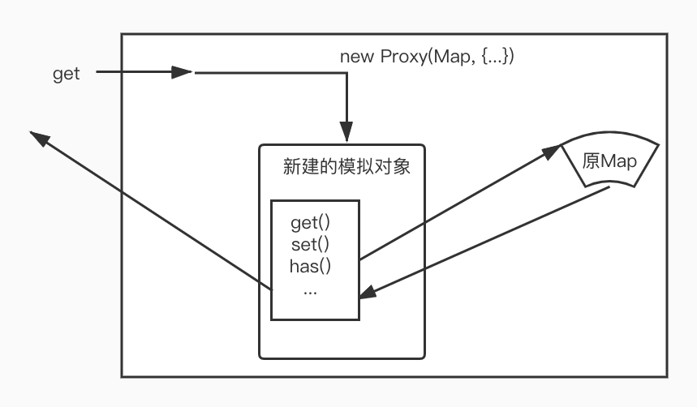

### 文件说明


本文件主要是为了拦截 (Weak)Map/Set 集合类型的操作，由于集合类型的设计原因，无法如普通对象一般进行 Proxy 代理。


为了解决该问题，使用了函数插桩的方法，来模拟 Map ，统一拦截 get 方法，再通过属性来反射调用其他的方法。


**集合类型的了解不是很深，仅能读懂本文件中每个函数代码的表面意义，但某一操作背后的原因不是十分清楚，鉴于简单阐述函数代码的表面意思意义不大，本说明不会对某些代码做具体阐述。**


**本文件说明只是尽量将自己关于对 Map/Set 集合类型代理的整体关系做一个阐述，便于理解其设计思想。**


#### 1. 为什么和普通对象代理不同？

```typescript
const m = new Map()

const p = new Proxy(m, {
  set (target, key, value, receiver) {
    console.log('target == ', target)
    console.log('key === ', key)
    console.log('value === ', value)
    console.log('receiver === ', receiver)
  }
})


p.set('test', 123)
```

这段代码运行就会报错，因为 Map 的底层使用了`receiver`作为`this`的指向来访问，而上述代码的`receiver`指向的是`p`，并非 Map 本身。

```typescript
const m = new Map()

const h = {
  get (key) {
    console.log('this === ', this)
    console.log('get key === ', key)
  },
  set (key, val) {
    console.log('set Key == ', key)
    console.log('set value == ', val)
  }
}

const p = new Proxy(m, {
  get(target, key, receiver) {
    console.log('key === ', key, '   type === ', typeof key)
    return Reflect.get(h, key, receiver)
  }
})


p.get('foo')

// 打印结果：
// key ===  get    type ===  string
// this ===  Map {}
// get key ===  foo

p.set('foo', 123)

// 打印结果：
// key ===  set    type ===  string
// set Key ==  foo
// set value ==  123


```

而上面这段代码可见，Map 的`get`方法我们代理是没有问题的。

并且，我们使用`p.get('foo')`、`p.set('foo', 123)`这种方法，`get`和`set`会被当做拦截的`get`的`key`值来处理。


既然如此，那就可以只代理集合类的 get 方法，通过插桩函数，来反射其他的操作方法。


#### 2. 个人理解向




这里做了一张简单的图来帮助解释其中的原理。


首先，我们的`new Proxy`代理对象仅仅代理`get`方法，通过判断实际调用的方法的名字，set/has/clear...... 来判断我们是否有相应的函数拦截器，有的话就会调用。


在调用拦截器的过程中，会对真实的 Map 使用对应的原生方法(set/has/clear......)操作，然后只要进行相应的依赖收集以及更新触发即可。


当然，如果 Map 中存的对象，会在获取时转换成对应的响应式对象。